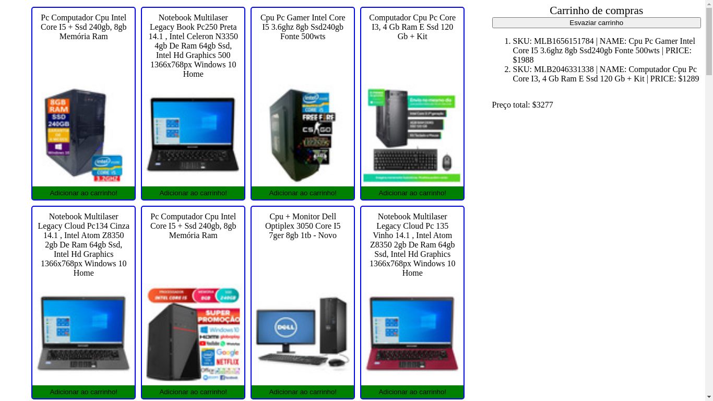

# Trybe Project Shopping Cart 12/08/2021
 

  
  
  

 

## Habilidades

- Fazer requisições a uma API (Application Programming Interface) do Mercado Livre;
- Utilizar os seus conhecimentos sobre JavaScript, CSS e HTML;
- Trabalhar com funções assíncronas.

## Desenvolvimento
Um [carrinho de compras](https://weltonthomasferreira.github.io/trybe-project-shopping-cart/) totalmente dinâmico, consumindo dados diretamente de uma API.

## Resultados

- `3` dia de projeto;
- `7` requisitos;
- Percentual de cumprimento de requisitos obrigatórios `100.00%`;
- Percentual de cumprimento de requisitos totais `100.00%`.

